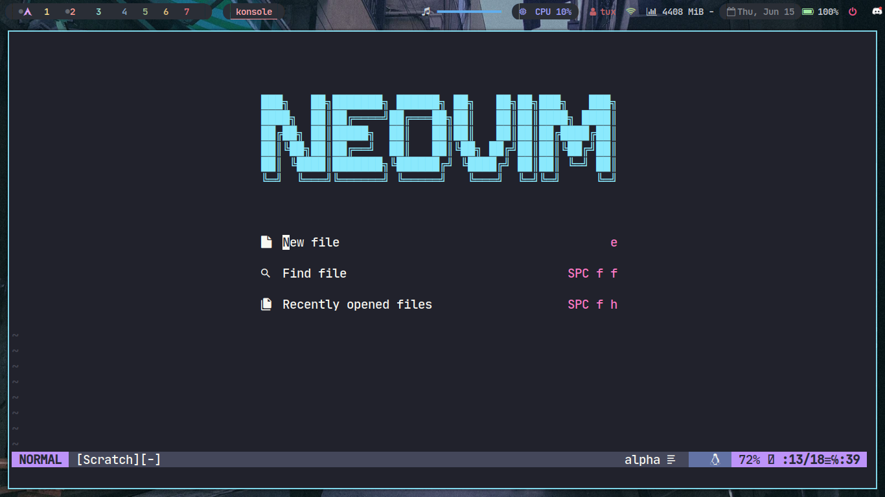
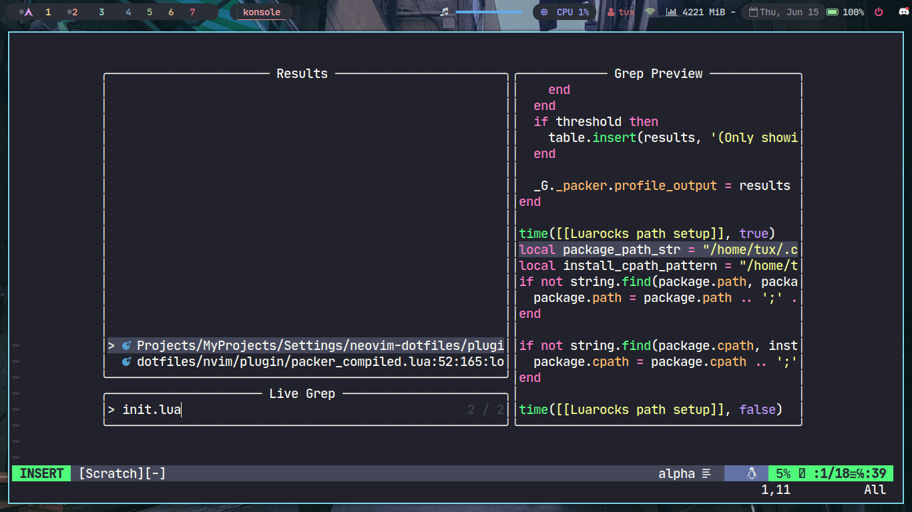
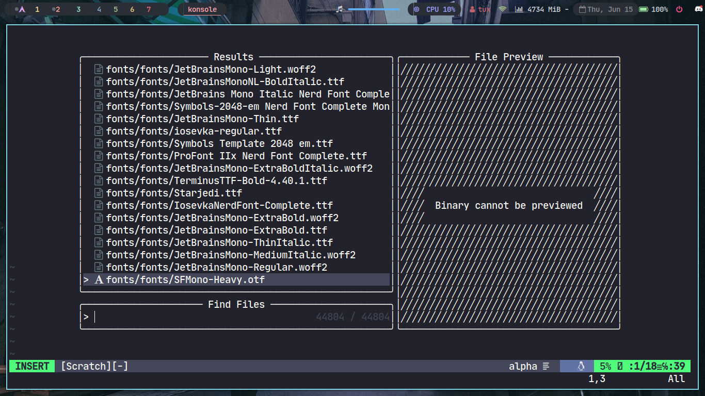
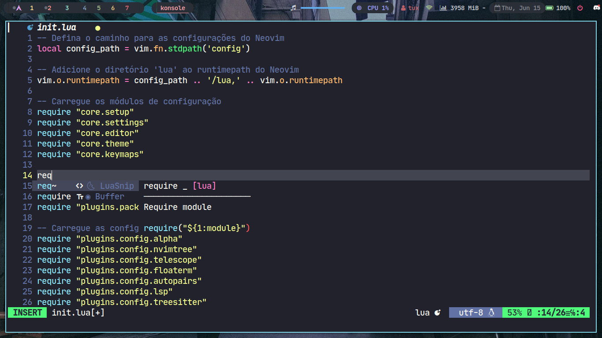
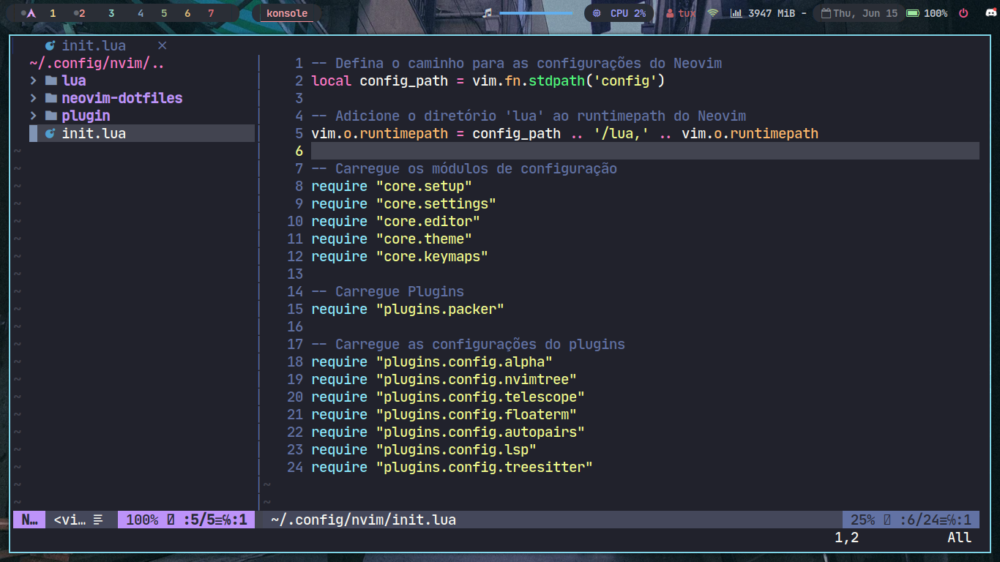
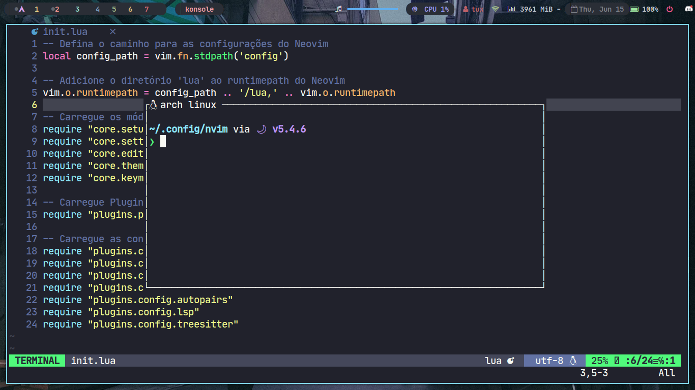

# Neovim Dotfiles

Este repositório contém os arquivos de configuração (dotfiles) para o Neovim, um editor de texto altamente configurável e extensível.

## Apresentação








## Dependências

Certifique-se de ter as seguintes dependências instaladas antes de utilizar esses dotfiles:

- [Neovim](https://neovim.io/) - O editor de texto em si.
- [Packer](https://github.com/wbthomason/packer.nvim) - Um gerenciador de plugins para o Neovim.

## Estrutura de arquivos

```
├── init.lua
├── lua
│   ├── core
│   │   ├── editor.lua
│   │   ├── keymaps.lua
│   │   ├── settings.lua
│   │   ├── setup.lua
│   │   └── theme.lua
│   └── plugins
│       ├── config (configuração de cada plugin)
│       │   ├── alpha.lua
│       │   ├── autopairs.lua
│       │   ├── floaterm.lua
│       │   ├── lsp.lua
│       │   ├── nvimtree.lua
│       │   ├── py_lsp.lua
│       │   ├── telescope.lua
│       │   └── treesitter.lua
│       └── packer.lua (init plugins)
└── plugin
    └── packer_compiled.lua
```

## Instalação

1. Clone este repositório em sua máquina:

   ```shell
   git clone https://github.com/seu-usuario/neovim-dotfiles.git
   ````

2. Copie os arquivos de configuração para o diretório do Neovim:

    ```shell
    cp -r neovim-dotfiles/* ~/.config/nvim/
    ```

3. Instale o Packer seguindo as instruções em sua página do GitHub.
4. Abra o Neovim e execute o comando `:PackerSync` para instalar os plugins.
5. Reinicie o Neovim.
